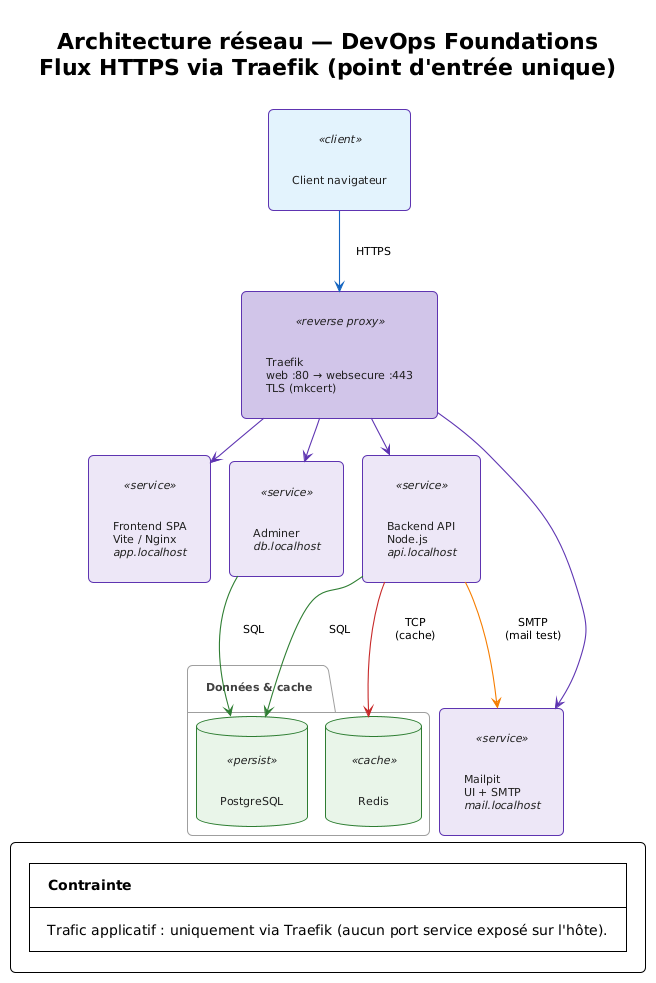

# Architecture réseau

Ce document décrit les flux de trafic, le rôle de Traefik, la segmentation des réseaux Docker et les choix de sécurité pour le projet DevOps Foundations.

## Vue d’ensemble

Le navigateur (ou un client HTTP) n’accède jamais directement aux ports des conteneurs applicatifs. Tout passe par **Traefik**, seul point d’entrée exposé sur l’hôte (`80` et `443`). Les services sont routés par **nom d’hôte** (`Host(...)`) vers le bon conteneur.

Schéma logique (lisible partout, sans moteur Mermaid) :

```text
                    HTTPS (routage par Host)
Client  ──────────────────►  Traefik  ──┬──►  frontend   (app.localhost)
                         :80/443       ├──►  backend     (api.localhost)
                                       ├──►  adminer     (db.localhost)
                                       └──►  mailpit     (mail.localhost)
```

Pour une vue avec les liens vers PostgreSQL, Redis et SMTP, voir la figure ci-dessous (PNG).

## Flux HTTP et HTTPS

1. **Entrée** : `web` (port 80) redirige de façon permanente vers `websecure` (HTTPS, port 443).
2. **TLS** : les certificats mkcert sont fournis par les fichiers montés dans Traefik (`traefik/certs`, voir `traefik/dynamic/tls.yml`).
3. **Routage** : le provider Docker découvre les conteneurs avec `traefik.enable=true` et des labels sur le réseau `public`. Chaque route associe un `Host` (ex. `app.localhost`, `api.localhost`) à un service backend et un port interne (load balancer Traefik).

## Traefik : providers, routeurs, services, middlewares

- **Provider Docker** : Traefik lit les labels des conteneurs sur le réseau attaché (`--providers.docker.network=public`). Les services ne sont pas exposés par défaut (`exposedbydefault=false`) : il faut `traefik.enable=true`.
- **Provider fichier** : configuration statique dans `traefik/dynamic/` (middlewares partagés, TLS).
- **Routeurs** : règles `Host(...)`, entrypoint `websecure`, middlewares appliqués.
- **Services** : pour chaque conteneur, le port cible est explicité avec `traefik.http.services.<nom>.loadbalancer.server.port` lorsque le conteneur n’expose pas le port attendu par défaut (ex. Nginx sur 8080, Vite sur 5173 en dev).
- **Middlewares** (fichier `dynamic/middlewares.yml`) :
  - `compress@file` : compression gzip.
  - `secure@file` : en-têtes de sécurité (HSTS, `X-Frame-Options`, `X-Content-Type-Options`, etc.).
  - `api-ratelimit@file` : limitation du débit sur l’API uniquement (pas sur la SPA statique).

## Réseaux Docker

| Réseau | Contenu typique | Rôle |
|--------|-----------------|------|
| `public` | Traefik, frontend, backend, Adminer, Mailpit | Routage HTTPS vers les services « exposés » via le proxy. |
| `backend` | PostgreSQL, Redis, backend, Adminer, Mailpit | Données et services internes ; pas de conteneur **uniquement** front sur ce réseau. |

Le **frontend** (SPA statique ou serveur Vite en dev) est sur **`public` uniquement**. Il n’a pas besoin d’accéder à PostgreSQL ou Redis : il appelle l’API en HTTPS sur `api.localhost`, et le backend sur le réseau `backend` joint la base et le cache.

## Schéma d’architecture



## Justification des choix de sécurité

### Pas d’exposition directe des ports applicatifs

Seuls les ports 80/443 sont publiés pour l’utilisateur. Les API et UIs ne sont pas en `ports:` sur l’hôte, ce qui réduit la surface d’attaque et force un passage par le reverse proxy (TLS, en-têtes, rate limit).

### HTTPS et en-têtes

Le trafic applicatif est servi en HTTPS avec certificats locaux (mkcert). Les middlewares `secure` renforcent le navigateur (HSTS, désactivation du MIME sniffing, etc.).

### Rate limiting ciblé

Le `rateLimit` s’applique au routeur **API** via `api-ratelimit@file`, pas au frontend statique, pour limiter les abus sans pénaliser le chargement des assets.

### Isolation réseau

PostgreSQL et Redis ne sont pas sur le réseau `public`. Un conteneur placé uniquement sur `public` (comme le frontend en production) ne peut pas joindre la base directement au nom du service Docker.

### Authentification aux outils sensibles

Le dashboard Traefik et Adminer sont protégés par **Basic Auth** : les hachages htpasswd (bcrypt) sont dans des fichiers **non versionnés** sous `traefik/auth/` (générés par `scripts/generate-dashboard-auth.sh` à partir du `.env`).

### Secrets

Les secrets et mots de passe restent dans `.env` (non versionné) ; `.env.example` documente les clés sans valeurs sensibles réelles.
