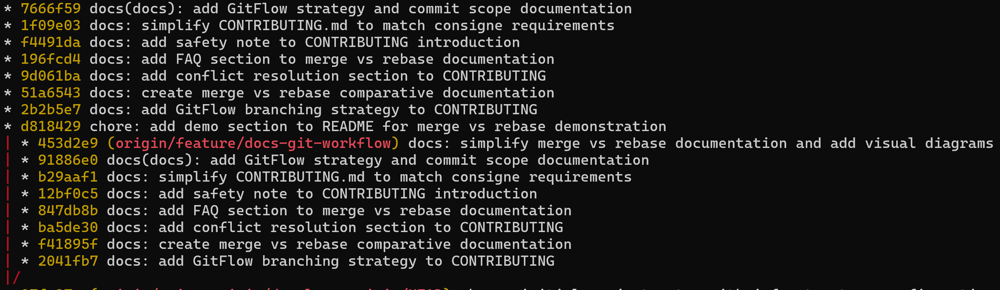

# Merge vs Rebase : Analyse Comparative

## Introduction

Dans Git, il y a deux stratégies principales pour intégrer des changements d'une branche vers une autre : **merge** et **rebase**. Ce document analyse les deux approches, leurs avantages, leurs inconvénients, et définit la méthode choisie pour ce projet.

---

## Vue d'ensemble

### Merge

Le **merge** crée un commit de fusion qui combine l'historique de deux branches, cette méthode préserve l'historique complet du projet.

### Rebase

Le **rebase** réécrit l'historique en déplaçant les commits d'une branche sur la pointe d'une autre, créant un historique linéaire.

---

## Analyse Comparative

### Merge

#### Avantages

1. **Préservation de l'historique**
   - Conserve l'historique complet du projet
   - Permet de voir quand et comment les branches ont été intégrées
   - Utile pour le debugging et l'audit

2. **Sécurité**
   - Ne modifie pas l'historique existant
   - Pas de risque de perdre des commits
   - Idéal pour les branches partagées

3. **Simplicité**
   - Opération atomique (un seul commit de merge)
   - Pas besoin de résoudre les conflits plusieurs fois
   - Facile à comprendre pour les débutants

4. **Traçabilité**
   - Les commits de merge indiquent clairement les intégrations
   - Facilite la compréhension de l'évolution du projet

#### Inconvénients

1. **Historique complexe**
   - Crée un historique "en arbre" difficile à lire
   - Peut devenir confus avec de nombreuses branches
   - Les graphiques Git deviennent rapidement illisibles

2. **Commits de merge "polluants"**
   - Les commits de merge n'apportent pas de valeur fonctionnelle
   - Encombrent l'historique avec des commits techniques

3. **Pas d'historique linéaire**
   - Difficile de suivre l'ordre chronologique réel
   - Les `git log` peuvent être verbeux

### Rebase

#### Avantages

1. **Historique linéaire et propre**
   - Crée un historique facile à lire
   - Les commits apparaissent dans l'ordre chronologique
   - Graphiques Git clairs et simples

2. **Pas de commits de merge**
   - Historique sans "pollution" technique
   - Chaque commit représente une fonctionnalité réelle

3. **Facilite la review**
   - Plus facile de voir les changements dans une PR
   - Les diffs sont plus clairs

4. **Cherry-pick simplifié**
   - Plus facile de sélectionner des commits spécifiques
   - Les commits sont indépendants

#### Inconvénients

1. **Réécriture de l'historique**
   - Modifie les SHA des commits
   - Peut causer des problèmes si la branche est partagée
   - Risque de perdre des commits si mal utilisé

2. **Résolution de conflits multiple**
   - Peut nécessiter de résoudre les mêmes conflits plusieurs fois
   - Un conflit par commit à rebaser

3. **Complexité**
   - Plus difficile à comprendre pour les débutants
   - Nécessite une bonne compréhension de Git

4. **Danger sur les branches partagées**
   - Ne jamais rebaser une branche déjà poussée et partagée
   - Peut causer des problèmes pour les autres développeurs

---

## Démonstration dans l'Historique Git

### Exemple réel : Démonstration visuelle

Cette section présente un exemple réel tiré de l'historique du projet lors de la démonstration de merge vs rebase sur la branche `feature/docs-git-workflow`.

**Description de l'image** :

L'image montre l'historique Git avec deux séquences de commits :

- **Première séquence (haut)** : Historique initial de la branche avec 8 commits (7666f59 à d818429)
- **Deuxième séquence (bas)** : Historique après rebase avec 8 commits (453d2e9 à 2041fb7), visualisée par la ligne rouge indiquant la branche `origin/feature/docs-git-workflow`

### Observations importantes

1. **Réécriture des commits** : Les commits `91886e0` à `2041fb7` ont les mêmes messages que `7666f59` à `2b2b5e7`, mais avec des **hash différents**. Cela démontre que le rebase a réécrit l'historique.

2. **Nouveau commit ajouté** : Le commit `453d2e9` est unique à la branche rebasée et représente un nouveau travail effectué après le rebase.

3. **Commit non rebasé** : Le commit `d818429` (chore: add demo section) n'apparaît pas dans la séquence rebasée, ce qui peut indiquer qu'il a été supprimé ou qu'il était sur une autre branche.

4. **Visualisation de la branche** : La ligne rouge dans `git log --graph` indique visuellement la branche `feature/docs-git-workflow` après le rebase.

## Conclusion

Pour ce projet **DevOps Foundations**, j'utilise une **approche basée uniquement sur le merge**.

### Pourquoi pas de rebase ?

Bien que le rebase puisse créer un historique visuellement plus linéaire, j'ai choisi de ne pas l'utiliser pour les raisons suivantes :

1. **Préservation de l'ordre temporel réel** : Le rebase réécrit l'historique et fausse l'ordre chronologique réel des commits. Un commit créé lundi peut apparaître comme créé mercredi après un rebase, ce qui complique le debugging et l'audit.

2. **Éviter la duplication des commits** : Le rebase crée de nouveaux commits avec de nouveaux hash pour le même contenu, dupliquant ainsi l'historique. Les commits originaux existent toujours (dans le reflog), créant une confusion entre les versions "originales" et "rebasées".

3. **Simplicité et sécurité** : Le merge est plus simple à comprendre, moins risqué, et préserve l'historique complet du projet sans modification.

4. **Traçabilité honnête** : Les commits de merge indiquent clairement quand et comment les branches ont été intégrées, reflétant la réalité du développement plutôt qu'une version réécrite.

### Politique adoptée

- **Merge uniquement** pour toutes les intégrations (feature → develop, develop → main, hotfix → main)
- **Utilisation de `--no-ff`** pour forcer les commits de merge et préserver la traçabilité
- **Historique complet préservé** : chaque commit garde sa date réelle et son contexte original

Cette approche garantit un historique Git **honnête, complet et exploitable** pour le debugging, l'audit, et la compréhension de l'évolution du projet, même si l'historique peut paraître plus complexe visuellement.
