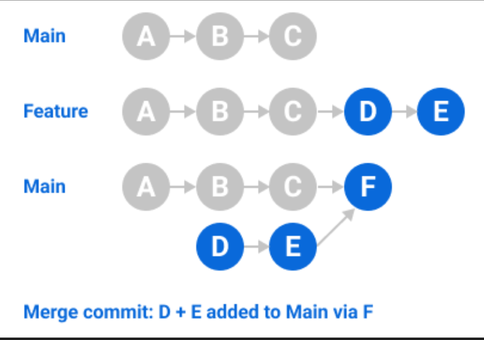
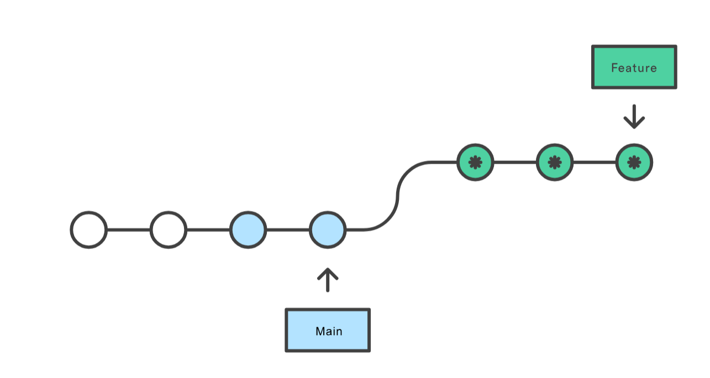

# Merge vs Rebase : Analyse Comparative

## Introduction

Dans Git, il y a deux stratégies principales pour intégrer des changements d'une branche vers une autre : **merge** et **rebase**. Ce document analyse les deux approches, leurs avantages, leurs inconvénients, et définit la méthode choisie pour ce projet.

---

## Vue d'ensemble

### Merge

Le **merge** crée un commit de fusion qui combine l'historique de deux branches, cette méthode préserve l'historique complet du projet.





### Rebase

Le **rebase** réécrit l'historique en déplaçant les commits d'une branche sur la pointe d'une autre, créant un historique linéaire.



---

## Analyse Comparative

### Merge

#### Avantages

1. **Préservation de l'historique**
   - Conserve l'historique complet du projet
   - Permet de voir quand et comment les branches ont été intégrées
   - Utile pour le debugging et l'audit

2. **Sécurité**
   - Ne modifie pas l'historique existant
   - Pas de risque de perdre des commits
   - Idéal pour les branches partagées

3. **Simplicité**
   - Opération atomique (un seul commit de merge)
   - Pas besoin de résoudre les conflits plusieurs fois
   - Facile à comprendre pour les débutants

4. **Traçabilité**
   - Les commits de merge indiquent clairement les intégrations
   - Facilite la compréhension de l'évolution du projet

#### Inconvénients

1. **Historique complexe**
   - Crée un historique "en arbre" difficile à lire
   - Peut devenir confus avec de nombreuses branches
   - Les graphiques Git deviennent rapidement illisibles

2. **Commits de merge "polluants"**
   - Les commits de merge n'apportent pas de valeur fonctionnelle
   - Encombrent l'historique avec des commits techniques

3. **Pas d'historique linéaire**
   - Difficile de suivre l'ordre chronologique réel
   - Les `git log` peuvent être verbeux

### Rebase

#### Avantages

1. **Historique linéaire et propre**
   - Crée un historique facile à lire
   - Les commits apparaissent dans l'ordre chronologique
   - Graphiques Git clairs et simples

2. **Pas de commits de merge**
   - Historique sans "pollution" technique
   - Chaque commit représente une fonctionnalité réelle

3. **Facilite la review**
   - Plus facile de voir les changements dans une PR
   - Les diffs sont plus clairs

4. **Cherry-pick simplifié**
   - Plus facile de sélectionner des commits spécifiques
   - Les commits sont indépendants

#### Inconvénients

1. **Réécriture de l'historique**
   - Modifie les SHA des commits
   - Peut causer des problèmes si la branche est partagée
   - Risque de perdre des commits si mal utilisé

2. **Résolution de conflits multiple**
   - Peut nécessiter de résoudre les mêmes conflits plusieurs fois
   - Un conflit par commit à rebaser

3. **Complexité**
   - Plus difficile à comprendre pour les débutants
   - Nécessite une bonne compréhension de Git

4. **Danger sur les branches partagées**
   - Ne jamais rebaser une branche déjà poussée et partagée
   - Peut causer des problèmes pour les autres développeurs

---

## Exemples Concrets

### Exemple 1 : Merge

**Scénario** : Intégrer une feature dans `develop`

```bash
git checkout develop
git pull origin develop

# On merge la feature
git merge --no-ff feature/add-redis-cache

# Résultat dans git log
*   Merge branch 'feature/add-redis-cache' into develop
|\
| * feat(backend): add Redis connection test
| * feat(backend): implement visit counter endpoint
| * docs: update API documentation
|/
* Previous commit on develop
```

**Avantages dans ce cas** :
- On voit clairement quand la feature a été intégrée
- L'historique de la feature est préservé
- Facile à annuler si nécessaire

### Exemple 2 : Rebase

**Scénario** : Mettre à jour une feature avec les derniers changements de `develop`

```bash
# Sur la branche feature
git checkout feature/add-redis-cache
git rebase develop

# Résultat dans git log (après merge dans develop)
* feat(backend): add Redis connection test
* feat(backend): implement visit counter endpoint
* docs: update API documentation
* Previous commit on develop
```

**Avantages dans ce cas** :
- Historique linéaire et propre
- Pas de commit de merge inutile
- Facile à suivre l'évolution

---

## Politique Choisie pour ce Projet

### Règle générale : **Merge pour l'intégration, Rebase pour la mise à jour**

#### Utiliser Merge pour :

1. **Intégrer une feature dans `develop`**
   ```bash
   git checkout develop
   git merge --no-ff feature/nom-feature
   ```
   - **Justification** : Préserve l'historique de la feature et indique clairement quand elle a été intégrée

2. **Intégrer `develop` dans `main` (release)**
   ```bash
   git checkout main
   git merge --no-ff develop
   git tag -a v1.0.0 -m "Release version 1.0.0"
   ```
   - **Justification** : Traçabilité des releases, historique complet

3. **Intégrer un hotfix dans `main`**
   ```bash
   git checkout main
   git merge --no-ff hotfix/fix-description
   ```
   - **Justification** : Sécurité et traçabilité des corrections critiques

#### Utiliser Rebase pour :

1. **Mettre à jour une feature avec `develop`**
   ```bash
   git checkout feature/nom-feature
   git rebase develop
   ```
   - **Justification** : Garde l'historique propre avant le merge final
   - **Important** : Uniquement si la branche n'est pas encore partagée

2. **Nettoyer l'historique avant un merge (optionnel)**
   ```bash
   # Squash les commits de la feature si nécessaire
   git rebase -i develop
   ```
   - **Justification** : Créer des commits atomiques et cohérents

### Règles strictes

1. **Ne jamais rebaser une branche déjà poussée et partagée**
   - Si d'autres développeurs travaillent sur la branche, utiliser merge
   - Le rebase doit être fait uniquement sur les branches locales

2. **Toujours utiliser `--no-ff` pour les merges**
   - Force la création d'un commit de merge même si fast-forward est possible
   - Préserve la traçabilité des intégrations

3. **Rebase uniquement sur les branches de feature locales**
   - Avant de créer la PR, rebaser sur `develop` pour avoir un historique propre
   - Une fois la PR créée, ne plus rebaser (utiliser merge pour intégrer les changements)

### Workflow Recommandé

1. Créer la feature depuis `develop` et développer (minimum 5 commits atomiques)
2. Mettre à jour avec `develop` via rebase (si branche locale)
3. Pousser la branche et créer la PR
4. Après approbation, merger dans `develop` via merge avec `--no-ff`

---

## Démonstration dans l'Historique Git

### Exemple de merge dans l'historique

```bash
# Voir l'historique avec les merges
git log --oneline --graph --all

# Résultat typique :
*   a1b2c3d Merge branch 'feature/add-redis-cache' into develop
|\
| * d4e5f6g feat(backend): implement visit counter endpoint
| * f7g8h9i feat(backend): add Redis connection test
| * h0i1j2k docs: update API documentation
|/
* j3k4l5m Previous commit on develop
```

### Exemple de rebase dans l'historique

```bash
# Voir l'historique après rebase et merge
git log --oneline --graph --all

# Résultat typique :
* d4e5f6g feat(backend): implement visit counter endpoint
* f7g8h9i feat(backend): add Redis connection test
* h0i1j2k docs: update API documentation
* j3k4l5m Previous commit on develop
```

**Note** : Après le merge final, l'historique linéaire du rebase est préservé, mais le commit de merge indique quand l'intégration a eu lieu.

---

## Conclusion

Pour ce projet **DevOps Foundations**, nous utilisons une **approche hybride** : **Merge pour l'intégration, Rebase pour la mise à jour**.

Cette politique combine la **sécurité** du merge (préservation de l'historique), la **propreté** du rebase (historique lisible), et la **traçabilité** (commits de merge indiquant les intégrations). Elle garantit un historique Git professionnel, exploitable pour le debugging, l'audit, et la compréhension de l'évolution du projet.

---

**Dernière mise à jour** : 2025-01-09
